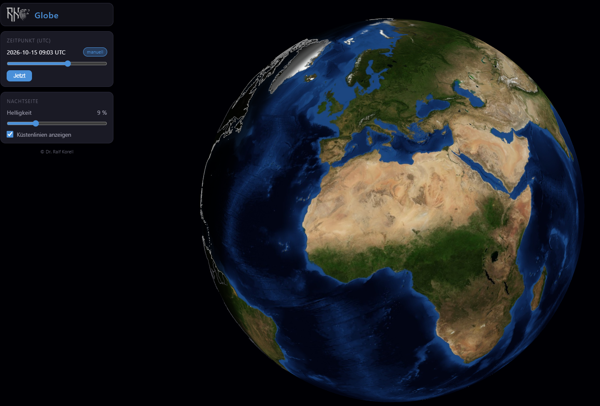

# Globe

Ein astronomisch korrekter 3D-Erdglobus für den Browser: frei drehbar,
zoombar, mit der Tag-/Nacht-Grenze (Terminator) für den aktuellen oder einen
frei wählbaren Zeitpunkt. Die Nachtseite bleibt durch eine regelbare
Grundaufhellung und eingeblendete Küsten- und Ländergrenzen lesbar.

Reines Vanilla-JavaScript ohne Build-Schritt — was im Repository liegt, lädt
der Browser direkt. Läuft vollständig offline.



## Highlights

- **Astronomisch korrekter Terminator** nach dem NOAA-Solar-Position-Algorithmus
  inklusive Zeitgleichung — der Sonnenstand stimmt auf Bruchteile eines Grades.
- **Gestufte Dämmerung** (bürgerlich / nautisch / astronomisch) statt harter
  Hell-Dunkel-Kante, berechnet im Fragment-Shader.
- **Freie Rotation in allen Achsen**, auch über die Pole hinweg — kein
  fixiertes Up-Vektor-Verhalten.
- **Meteosat-Startansicht:** die Perspektive des geostationären Meteosat-Prime-
  Service (Unterpunkt 0°/0°, 42.164 km Abstand).
- **Echte Ozeantopografie** durch eine Blue-Marble-Textur mit Bathymetrie.
- **Küstenlinien und Ländergrenzen** aus Natural Earth, nachtseitig sichtbar.
- **Sparsames Rendering:** genau zwei Shader-Materialien, keine Allokationen im
  Render-Loop, Darstellung nur bei Änderung.

## Voraussetzungen

- Aktueller Desktop-Browser (Chromium oder Firefox) mit WebGL.
- Python 3 für den mitgelieferten HTTP-Server (nur zum Ausliefern).
- Node.js ≥ 18 — **nur** für die Tests und die einmalige Asset-Vorbereitung,
  nie zur Laufzeit der App.

## Schnellstart

```bash
python3 serve.py          # startet auf Port 8000
python3 serve.py 8080     # alternativer Port
```

Danach im Browser öffnen: <http://localhost:8000/>

Der mitgelieferte `serve.py` liefert `.mjs`-Dateien mit korrektem
JavaScript-MIME-Typ (`text/javascript`) aus — Voraussetzung dafür, dass native
ES-Module ohne Build-Schritt geladen werden.

## Bedienung

| Aktion | Steuerung |
|---|---|
| Globus drehen | Maus ziehen (frei in allen Achsen, über die Pole) |
| Zoomen | Mausrad (2–20 Erdradien; Start 6,61 R = Meteosat-Perspektive) |
| Zeitpunkt wählen | Regler „Zeitpunkt" (beliebiger UTC-Zeitpunkt) |
| Zurück zur Echtzeit | Schaltfläche „Jetzt" (danach Update 1× pro Minute) |
| Nachtseite aufhellen | Regler „Helligkeit" (3–25 %) |
| Küsten/Grenzen ein/aus | Checkbox „Küstenlinien anzeigen" |

## Astronomische Genauigkeit

Die Sonnenstandsberechnung ist gegen unabhängige Quellen geprüft
(`tests/solar.test.mjs`):

| Zeitpunkt (UTC) | Erwartung | Toleranz |
|---|---|---|
| Äquinoktium 2025-03-20 12:00 | Deklination ≈ 0° | < 0,5° |
| Sommersonnenwende 2025-06-21 12:00 | Deklination ≈ +23,4° | ± 0,3° |
| Wintersonnenwende 2025-12-21 12:00 | Deklination ≈ −23,4° | ± 0,3° |
| Zeitgleichung 2025-11-03 | ≈ +16,5 min | < 1 min |
| Subsolare Länge 2025-11-03 12:00 | ≈ −4,1° (negativ) | ± 0,3° |

## Projektstruktur

```
index.html            Einstieg, Importmap für three.js
serve.py              statischer HTTP-Server mit .mjs-MIME-Typ
css/                  Oberfläche (blaues Farbschema, CSS-Custom-Properties)
src/
  data/               Datenermittlung – browserfrei, in Node importierbar
    config.mjs          zentrale Konstanten (Texturpfad, Auflösungsgrenzen)
    solar.mjs           NOAA-Sonnenstand inkl. Zeitgleichung
    twilight.mjs        Dämmerungsstufung (nightFactor)
    coastlines.mjs      Laden/Validieren der Geodaten
  view/               Präsentation – Szene, Shader, Controls, DOM
  main.mjs            Orchestrierung – einziger Treffpunkt beider Schichten
assets/               Erdtextur, Geodaten, Logo
vendor/three/         three.js (lokal, als ES-Modul)
tests/                node --test
tools/                einmalige Asset-Vorbereitung (nicht zur Laufzeit)
```

## Architektur

Die App ist strikt in zwei Schichten getrennt, die sich nur in `src/main.mjs`
begegnen:

- **Datenermittlung (`src/data/`)** kennt weder Renderer noch `document` oder
  `window`. Sie liefert ausschließlich neutrale Datenstrukturen und ist in Node
  ohne Browser importierbar — dadurch überhaupt testbar.
- **Präsentation (`src/view/`)** enthält keinerlei Kalender-, Zeitzonen- oder
  Astronomie-Rechnung. Der Terminator entsteht im Fragment-Shader aus der
  Sonnenrichtung, die die Datenschicht als subsolare Koordinaten liefert.

### Wesentliche Entwurfsentscheidungen

- **Kein Build-Schritt, native ES-Module.** Kein Bundler, kein Transpiler.
  Der Preis dafür ist der bewusste Verzicht auf JSX/TypeScript/Tailwind; der
  Gewinn ist ein Repository, das ohne Toolchain lädt und offline läuft.
- **three.js statt eigenem WebGL** (r178, lokal unter `vendor/`), eingebunden
  über eine Importmap.
- **Eigene Drag-Steuerung statt OrbitControls.** OrbitControls erzwingt ein
  festes Up-Vektor-Verhalten und schließt Rotation über die Pole aus; die
  kompakte Quaternion-Steuerung in `src/view/controls.mjs` erfüllt genau die
  geforderte freie Rotation.
- **Terminator im Shader.** Der Tag/Nacht-Übergang wird pro Fragment aus
  `dot(Normale, Sonnenrichtung)` berechnet und über eine Smoothstep-Kurve
  gestuft; die Mischung erfolgt im sRGB-Raum, damit der Helligkeitsabfall über
  hellem und dunklem Terrain gleich gleichmäßig wirkt.
- **Ein Linien-Material für Küste und Grenze.** Beide Datensätze liegen in
  einer Geometrie; eine Pro-Vertex-Kennung unterscheidet die Grautöne. So
  bleibt es bei genau zwei Shader-Materialien (Kugel und Linien).

## Tests & Qualitätssicherung

```bash
node --test tests/          # 22 Tests: Sonnenstand, Dämmerung, Geodaten
tools/check_dod.sh 8000     # Auslieferung, MIME-Typen, Struktur, Fehlerpfad
```

`check_dod.sh` prüft unter anderem: HTTP 200 für alle Ressourcen, korrekter
MIME-Typ aller `.mjs`, Schichtentrennung (keine Browser-Globals in `src/data/`,
keine Kalenderrechnung in `src/view/`), keine Allokationen im Render-Loop,
genau zwei Shader-Materialien und der Fehlerpfad bei fehlender Textur.

## Assets neu aufbereiten

Die aufbereiteten Assets liegen bereits im Repository. Zum Neuerzeugen:

**Erdtextur** — NASA Blue Marble Next Generation *Topography and Bathymetry*
(Juli), aus der Quelle 5400×2700 auf 4096×2048 skaliert und als JPEG
gespeichert. Zulässig sind Auflösungen bis 8192×4096 (`src/data/config.mjs`).

**Küstenlinien und Ländergrenzen** aus Natural-Earth-GeoJSON (1:50 m) in ein
kompaktes gemeinsames JSON überführen:

```bash
node tools/prepare_coastlines.mjs assets/geodata/coastlines_50m.json \
  0:ne_50m_coastline.geojson \
  1:ne_50m_admin_0_boundary_lines_land.geojson
```

## Datenquellen & Lizenzen

- **Erdtextur:** NASA Visible Earth — Blue Marble Next Generation (Public Domain).
- **Geodaten:** Natural Earth, 1:50 m (Public Domain).
- **3D-Bibliothek:** three.js, MIT-Lizenz (siehe `vendor/three/LICENSE`).

## Autor

© Dr. Ralf Korell
